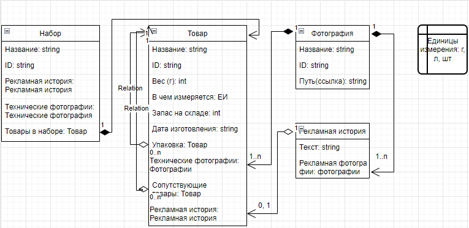
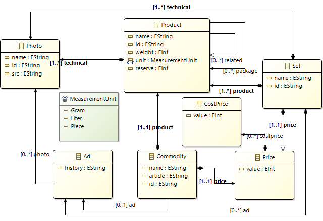
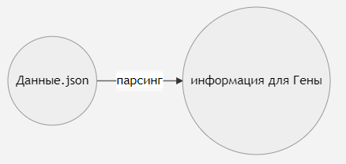

# Кто такой Гена
Мы хотим интернет-каталог. У нас есть разные товары с разными характеристиками, которые хранятся в .json. Мы хотим, что бы нам сгенерировали из этого .json HTML страницу. Тут к нам на помощь приходит Гена.

# Как придумать архитектуру
Наш проект состоит из задач. В зависимости от высоты, с которой мы смотрим на проект, в нём могут быть задачи разной величины. Одни задачки могут состоять из других.

# Посмотрим с самой большой высоты
Теперь нам надо сформулировать задача проекта самым ёмким способом:
> Генерировать интернет-каталог из данных пользователя.

Теперь поймём, кто актёр, а что есть действие. Актёры - интернет-каталог (ИК), данные (Данные с заглавной буквы), пользователь. Действия - генерировать, дать данные.

Составим блок-схему:

пользователь -> **данные ====> ИК**

Нам уже дают данные, нам их не надо генерировать по наставлению пользователя, так что пользователь остаётся за кадром.
Кто выполняет действие генерации? Гена!

Оба основных актёра состоят из маленьких кубиков, а Гена - из действий. А эти кубики состоят из других, а действия Гены из более маленьких и так далее. И мы не будем останавливаться в делении, пока мы не поймём, из чего состоят актёры и операции настолько, чтобы написать программу.

## Посмотрим с конца
ИК - это структурированный вид на Данные. Это то, что видит покупатель. Мы сначала должны понять, что надо видеть покупателю, чтобы понять, какие требования к Данным у нас должны быть. 
## Товары
Раз уж это каталог, то в нём есть товары.

- глиняная посуда
- иван-чай
- хлеб
- яйца
- пироги
- напитки
- упаковка

У товаров есть категории (вкладываются в друг друга) и типы (независимые относительно друг друга).

- категории
  - глина (например, глиняная тарелка)
  - еда
    - с длинным сроком хранения (например, чай)
    - с коротким сроком хранения (например, яйца)

Пример типа - яблочный пирог - это пирог.

У товаров есть ещё такие данные:
 - стоимость
 - вес
 - технические фотографии
 - рекламные фотографии
 - рекламная история
 - запас на складе
 - когда была изготовлена партия на складе
 - сопутствующие товары
 - упаковки (тоже товары)

К некоторым типам товаров нужны свои характеристики. К пирогам, например, нужна калорийность и состав. А к глиняным тарелкам - нет, но нужна информация про глазурь. То есть к благодаря его типу у товара могут появится особенные характеристики, которые есть не у всех.

У нас получилось много данных у каждого товара. Тогда заведём страничку для каждого товара. К ней можно будет перейти из главной страницы или страницы категории.

## Типы страниц
- главная страница
  - набор каталогов
- страница каталога
  - набор товаров 
- страница товара   
  - набор характеристик товара
  - рекламы
  - сопутствующих товаров
  - упаковок
 
## Товары чем-то похожи...
Мы заметили, что есть нечто похожее у товаров (см. "Посмотрим с конца"): цена, запас на складе, рекламная история... Только что перечислилены былы характреристики. Так же мы говорим о том, что без этих признаков товар не товар. Получается, что есть шаблон. Объект, построенным по этому шаблону - товар.

>Шаблон называется **классом**.

Рассмотрим признаки товара и составим по ней **схему классов**

Есть простые значения признаков - строка (string), число (int) и т.д. Например, характреристики `name`, `price`. Есть набор из таких значений - массив (ennum). На схеме можно увидеть `Units of Measurement`.

Все классы связаны. Рекламная история без фотографии имеет смысл, а фотография - нет. Этот тип связи называется **агрегацией**. Классы, связанные агрегацией, не родитель и ребёнок. Это другой вид отношений.

Товару и упаковка-товар имеют смысл без друг друга, но они связаны - они **ассоциируются** с друг другом.

>Агрегация, ассоциация, класс находятся в мире проектирования. Объект, постороенный по классу, находится в физическом мире.

## Дополняем схему классов, или Набор товаров
Со схемами классов всегда так, что переделывать их приходится много раз. Мы детализируем, исходя из наших нужд. Если мы будем менять их после того, как мы по ним что-то постороим, это будет очень неприятно.

У нас будет ещё набор товаров. Эти товары продаются и отдельно, но вместе образовывают набор с другой ценой и рекламной историей.

## Переделываем всё, или Товары и Продукты

Продуктом может быть всё что угодно, у нас будет тарелка. Ей можно пользоваться, например, положить в неё орехи. Как только продукт получает цену, он становится товаром. Товаром не пользуются, он спокойно лежит на складе или на полочке прилавка. Наш товар — тарелка "Паллада Красная" за 500 рублей. Это товар. Когда тарелку купят, её цена, артукул, рекламная история станут не важны. Теперь необходимы её вес, площадь, терпимость к разным способам чистки и готовки, годна дли эта тарелка для употребеления пищи и т. д. Тарелка снова стала продуктом. Её можно будет снова продать. Когда товар становится продуктом, продукт теряет характеристики первого. Когда появляется товар, то масса и цвет не пропадают, но эти свойства относятся к продукту. Получается, товар содержит в себе продукт.

## Как создать ИК, или следующее погружение

Вернёмся к нашему виду на схему. Мы уже рассмотрели основных двух актёров - входные данные и ИК. Теперь рассмотрим дейтсвие - создание ИК, основываясь на Данных.

Работу Гены можно разделить на две части - на парсинг и на создании ИК на основе данных, которые мы получили. Парсинг - это усвоение информации а нужном для программы формате (здесь - для создания ИК). Выход из парсинга должен быть удобным для создания ИК, поэтому разрабатывать мы должны их одновременно.

## Парсинг

Что такое парсинг? Это вычленение нужных данных из источника определённого образца.

Гена будет получать файл по абсолютному пути. Абсолютный путь пока что будем довать как строку, потом сделаем виджет.

В начале убедимся, что файл с данными нам подходит. Проверим файл на существование и на расширение (допускается только .json). Содержимое файла должно подходить образцу, что будет проверяться по ходу вычленению данных.

Можно было бы перебирать побуквенно содержимое файла и определять границы ключей и значений, но Python уже умеет работать с JSON, что мы и используем.

## Гена пошёл работать

У нас есть данные, с помощью парсинга Гена их переварил. Настало время генерации сайта.

Сайт будет собой представлять папку с index.html, другими страницами, от страниц категорий и товаров, до служебных, изображениями, файлами.css. Сейчас же мы попробуем вывести на страницу информацию о нашем товаре.

Мы будем генерировать из данных страницу HTML и прикреплять к ней описательные картинки с помощью Python-а. Будем заносить в файл данные, будто мы пишем от руки.

Наша задача непростая, сложно представить со всеми её деталями, как реализовать её. Строить её надо, как дом: сначала заложить фундамент и каркас, потом создать голые помещения, провести коммуникации, заняться внутренней отделкой, поставить мебель, украсить всё и так далее. Остановиться можно на любом этапе, но успешные проекты развиваются вглубь и вширь (пристраивать здания к основному.)

Зальём фундамент.

Для начала вынесем все данные в index.html. Потом каждому товару создадим страницу, а ссылки на них (с картинками) расположим в index.html. Пока что выглядит некрасиво, да?

## Гена доверяет, но проверяет

Гена имеет дело с большими данными, которые составляет человек, а значит, могут быть подвержены ошибкам. Гена не будет работать из-за ошибки, но и посетители сайта увидят ложную информацию. Значит, надо обнаружить ошибку. Надо ли её решать? Только по просьбе пользователя. Например, в папке, указанным пользователем, нет data.json. Не надо создавать его, хоть и пустым. Надо сообщить пользователю и предложить пути решения, тогда человек выберет удобный и получит пользу.   