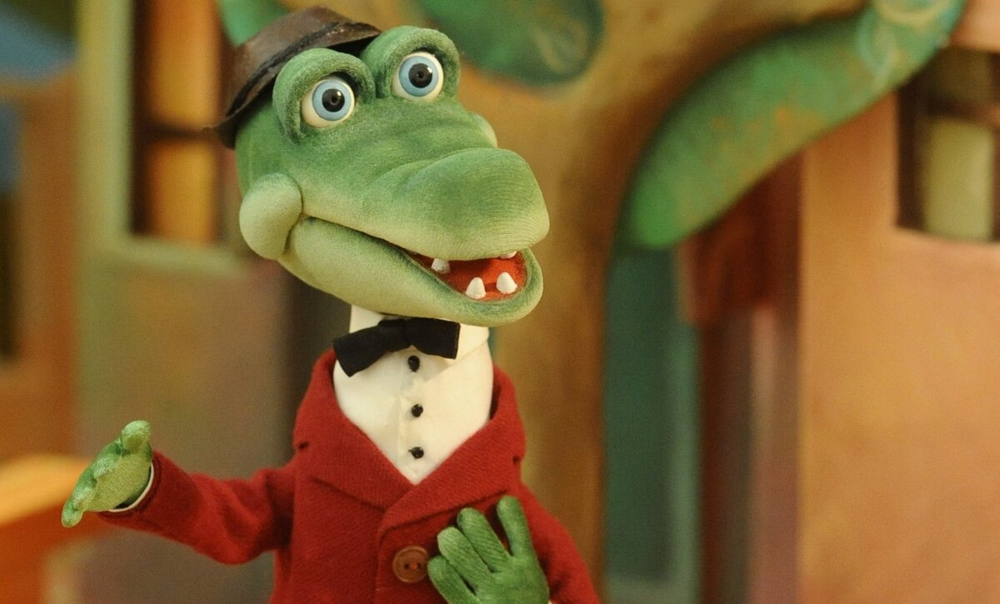
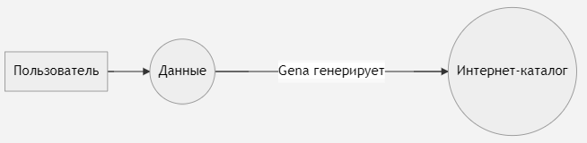
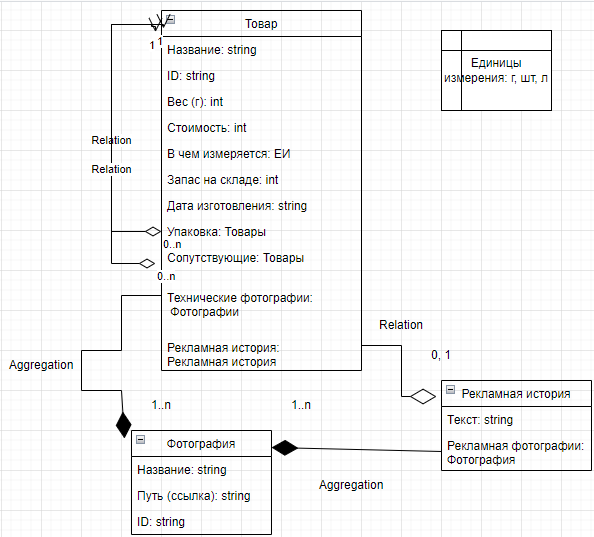

# Кто такой Гена
Мы хотим интернет-каталог. У нас есть разные товары с разными характеристиками, которые хранятся в .json. Мы хотим, что бы нам сгенерировали из этого .json HTML страницу. Тут к нам на помощь приходит Гена.

# Как придумать архитектуру
Наш проект состоит из задач. В зависимости от высоты, с которой мы смотрим на проект, в нём могут быть задачи разной величины. Одни задачки могут состоять из других.

## Посмотрим с самой большой высоты
Теперь нам надо сформулировать задача проекта самым ёмким способом:
> Генерировать интернет-каталог из данных пользователя.

Теперь поймём, кто актёр, а что есть действие. Актёры - интернет-каталог (ИК), данные (Данные с заглавной буквы), пользователь. Действия - генерировать, дать данные.

Составим блок-схему:

пользователь -> **данные ====> ИК**

Нам уже дают данные, нам их не надо генерировать по наставлению пользователя, так что пользователь остаётся за кадром.
Кто выполняет действие генерации? Гена!

Оба основных актёра состоят из маленьких кубиков, а Гена - из действий. А эти кубики состоят из других, а действия Гены из более маленьких и так далее. И мы не будем останавливаться в делении, пока мы не поймём, из чего состоят актёры и операции настолько, чтобы написать программу.

## Посмотрим с конца
ИК - это структурированный вид на Данные. Это то, что видит покупатель. Мы сначала должны понять, что надо видеть покупателю, чтобы понять, какие требования к Данным у нас должны быть. 
## Товары
Раз уж это каталог, то в нём есть товары.

- глиняная посуда
- иван-чай
- хлеб
- яйца
- пироги
- напитки
- упаковка

У товаров есть категории (вкладываются в друг друга) и типы (независимые относительно друг друга).

- категории
  - глина (например, глиняная тарелка)
  - еда
    - с длинным сроком хранения (например, чай)
    - с коротким сроком хранения (например, яйца)

Пример типа - яблочный пирог - это пирог.

У товаров есть ещё такие данные:
 - стоимость
 - вес
 - технические фотографии
 - рекламные фотографии
 - рекламная история
 - запас на складе
 - когда была изготовлена партия на складе
 - сопутствующие товары
 - упаковки (тоже товары)

К некоторым типам товаров нужны свои характеристики. К пирогам, например, нужна калорийность и состав. А к глиняным тарелкам - нет, но нужна информация про глазурь. То есть к благодаря его типу у товара могут появится особенные характеристики, которые есть не у всех.

У нас получилось много данных у каждого товара. Тогда заведём страничку для каждого товара. К ней можно будет перейти из главной страницы или страницы категории.

## Типы страниц
- главная страница
  - набор каталогов
- страница каталога
  - набор товаров 
- страница товара   
  - набор характеристик товара
  - рекламы
  - сопутствующих товаров
  - упаковок

<<<<<<< HEAD
 
## Товары чем-то похожи...
Мы заметили, что есть нечто похожее у товаров (см. "Посмотрим с конца"): цена, запас на складе, рекламная история... Только что перечислилены былы характреристики. Так же мы говорим о том, что без этих признаков товар не товар. Получается, что есть шаблон. Объект, построенным по этому шаблону - товар.

>Шаблон называется **классом**.

Рассмотрим признаки товара.

Есть простые значения признаков - строка (string), число (int) и т.д. Например, характреристики `name`, `price`. Есть набор из таких значений - массив (ennum). На схеме можно увидеть `Units of Measurement`.

Все классы связаны. Рекламная история без фотографии имеет смысл, а фотография - нет. Этот тип связи называется агрегацией. Товару и упаковка-товар имеют смысл без друг друга, но они связаны - они ассоциируются с друг другом.
