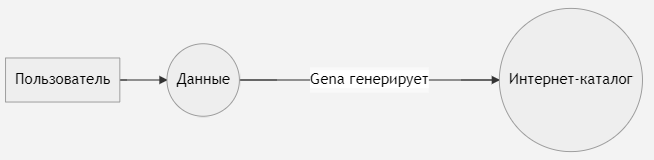

# Кто такой Гена
Мы хотим интернет-каталог. У нас есть разные товары с разными характеристиками, которые хранятся в .json. Мы хотим, что бы нам сгенерировали из этого .json HTML страницу. Тут к нам на помощь приходит Гена.

# Как придумать архитектуру
Наш проект состоит из задач. В зависимости от высоты, с которой мы смотрим на проект, в нём могут быть задачи разной величины. Одни задачки могут состоять из других.

## Посмотрим с самой большой высоты
Теперь нам надо сформулировать задача проекта самым ёмким способом:
> Генерировать интернет-католог из данных пользователя.

Теперь поймём, кто актёр, а что есть действие. Актёры - интернет-католог (ИК), данные, пользователь. Действия - генерировать, дать данные.

Составим блок-схему:

пользователь -> **данные ====> ИК**

Нам уже дают данные, нам их не надо генерировать по наставлению пользователя, так что пользователь остаётся за кадром.
Кто выполняет действие генерации? Гена!
## Посмотрим с конца
Что бы понять, как мы будем принимать данные, нам нужно сначала понять, как мы их будем использовать. То есть нам надо придумать дизайн интернет-каталога. Он будет состоять из главной страничек и страничек товара.
## Товары
Раз уж это каталог, то в нём есть товары.

- глиняная посуда
- иван-чай
- хлеб
- яйца
- пироги
- напитки
- упаковка
- 
Но будем смотреть со стороны покупателя. Как нам было удобно искать товары? Давайте их категоризируем.

- категории
  - глина
  - еда
    - с длинным сроком хранения
    - с коротким сроком хранения

Если товара нет на складе, то он не генерируется.

Теперь поговорим о странице товара.

Мы хотим продавать не только основные товары, но и сопуствующие: к пирогу хочется горячего напитка, к яйцам - мешочек. Получается, на страничке товара нам должны предлагаться сопутсвующие товары и упаковка, причём не к какждому товару подходят все упаковки.
 
На странице должны быть:
 - стоимость
 - вес
 - технические фотографии
 - рекламные фотографии
 - рекламная история
 - запас на складе
 - когда была изготовлена партия на складе
К некоторомым типам товаров нужны свои характеристики. К пирогам, например, нужна калорийность и состав. А к глинянным тарелкам - нет, но нужна информация про глазурь.
 
